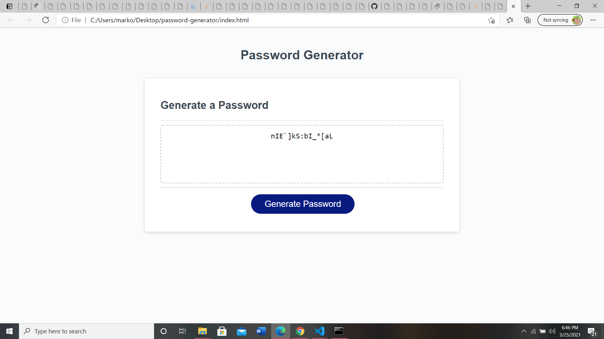

# Password Generator

## Site Picture

## Deployed Site
[Site](https://markosanchez800.github.io/password-generator/)

## Technology Used
- HTML - Used to create basic structure and flow of the site
- CSS - Used to give the page an individual aesthetic style as well as format for other screen types
- JavaScript - Used to give the site all of its actual functionality (User input, array sorting, randomizing variables, and output)
- Github - Used as the repository for site
- Gitbash - Used to commit and push code to Github as to track changes/progress

## Summary
This site is used to randomly generate a password from a specific set of conditions.  All character values are stored in separate arrays and are joined together using concatenation depending on the conditions selected by the user from the popup boxes.  A for loop then takes those selected characters and randomizes them using the Math class and pushes the random characters one by one until the character limit is reached and the password is displayed onscreen for the user.

## Code Snippet

    function generatePassword(){ 
    var tempPass = ""; 
    var charLim = window.prompt("How many characters should the password be 8-128")
    if (charLim < 8 || charLim > 128){
    alert("Start over and select a number within correct bounds");
    return;
    }
    specChar = window.confirm("Special Characters?")
    lilChar = window.confirm("Lowercase letters?")
    capChar = window.confirm("Capital letters?")
    numChar = window.confirm("Numbers?")

### Author Links
- [LinkedIn](https://www.linkedin.com/in/marko-sanchez-800)
- [GitHub](https://github.com/markosanchez800)